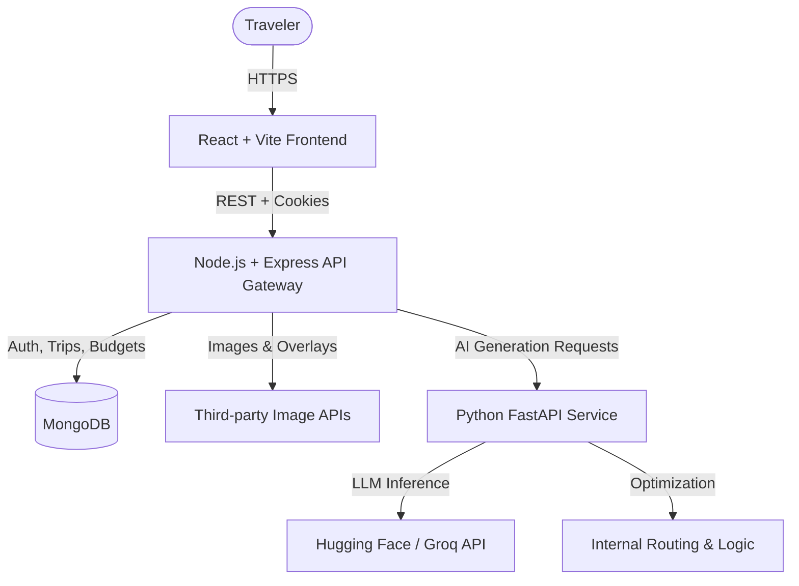
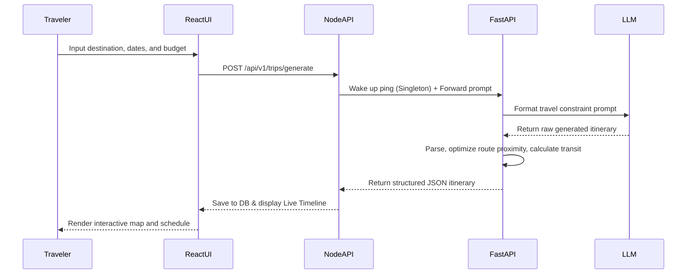

<div align="center">
  <!-- Replace with actual logo if available -->
  

  # Wanderwise AI

  **An intelligent, full-stack travel companion that generates, optimizes, and manages your itineraries using AI.**

  [](https://react.dev/)
  [](https://nodejs.org/)
  [](https://fastapi.tiangolo.com/)
  [](https://www.mongodb.com/)
  [](https://tailwindcss.com/)
</div>

---

## Project Overview

### Problem Statement

Planning a trip can be overwhelming. Travelers often struggle to balance budgets, optimize travel routes, account for realistic transit times, and adapt on-the-fly when schedules or weather conditions change. Traditional planning tools lack the intelligence to dynamically piece these variables together.

### Our Solution

Wanderwise AI acts as your personal, proactive travel agent:
1. **Intelligent Trip Generation** — Tell the AI where you're going and what your budget is, and it generates a structured, day-by-day plan.
2. **Dynamic Live Timelines** — Calculates realistic transit caps, lunch breaks, and proximity-based routes to ensure your schedule is actually achievable.
3. **Real-time Budget Tracking** — Logs expenses dynamically and flashes alerts instantly if your itinerary starts creeping over your designated budget.
4. **Visual Exploration** — Automatically fetches highly relevant cover images and activity photos to bring your itinerary to life before you even pack your bags.
5. **Robust Architecture** — Built with intelligent "Cold Start" resilience, seamlessly orchestrating traffic between a Node.js API gateway and a Python machine learning microservice without breaking under load.

---

## System Architecture

### High-Level Architecture



### AI Trip Generation Pipeline



---

## Core Features

### AI Trip Planner & Optimizer
- Prompt-based trip generation grounded in real geographical logic.
- Proximity-first timeline scheduling (groups nearby activities to minimize transit time).
- Automatic lunch break and transit gap calculations.
- Live photo fetching for activities and destinations.

### Interactive User Dashboard
- Real-time timeline view reflecting your daily schedule.
- Seamless authentication (Login, Register, OTP Verification, Password Reset).
- Visual expense charts and "Over Budget" toast notifications.
- Interactive checklist and companion features.

### Robust Backend Infrastructure
- **Thundering Herd Protection**: Implements a Promise Singleton (`ensureAIAwake`) to elegantly queue concurrent frontend requests while the heavy Python ML service boots up from sleep.
- Cache-busting mechanisms and TCP connection cycling for maximum reliability on Serverless architectures.
- Centralized error handling and detailed debug logging.

---

## Technology Stack

### Frontend
- **React 18** with **Vite** for blazing fast HMR and optimized builds.
- **Redux Toolkit** for predictable, centralized state management (Auth, Trips).
- **React Router** for seamless SPA navigation.
- **Tailwind CSS** for modern, responsive, utility-first styling.
- **Axios** for API communication.
- **React Toastify** for instant feedback alerts.

### API Gateway (Backend)
- **Node.js 20** with **Express.js**.
- **MongoDB** via **Mongoose** for persistent data models.
- **JWT** (JSON Web Tokens) with secure, `httpOnly` cross-origin cookies.
- Intelligent proxy logic to safely ping and queue requests to the AI microservice.

### AI Microservice
- **Python 3.10+** and **FastAPI**.
- Generative AI integrations (Hugging Face / LLMs) for content synthesis.
- Pandas/Numpy (optional depending on routing logic) for array-based proximity clustering.

---

## API Overview

### Authentication
| Method | Endpoint | Description |
|---|---|---|
| `POST` | `/api/v1/auth/register` | Register a new traveler account |
| `POST` | `/api/v1/auth/login` | Authenticate and set JWT cookie |
| `GET` | `/api/v1/auth/logout` | Securely clear JWT cookie session |
| `GET` | `/api/v1/auth/me` | Fetch active user profile |
| `POST` | `/api/v1/auth/password/forgot` | Trigger password reset flow |
| `PUT` | `/api/v1/auth/password/reset/:token` | Finalize password reset |

### Trips & Itineraries
| Method | Endpoint | Description |
|---|---|---|
| `GET` | `/api/v1/trips` | Fetch all trips for the logged-in user |
| `GET` | `/api/v1/trips/:id` | Get specific trip details |
| `GET` | `/api/v1/itineraries/search-image` | Fetch live photo for a destination |
| `POST`| `/api/v1/ai/schedule-trip` | (Proxied to FastAPI) Generate full itinerary |
| `GET` | `/api/v1/trips/:id/expenses/summary` | Fetch live budget status |

---

## Quick Start

### Prerequisites
- Node.js 20+
- Python 3.10+
- MongoDB instance (Local or Atlas)
- Required API Keys (AI Provider, Image Provider)

### 1. Clone the Repository
```bash
git clone https://github.com/sachinyadav1131/Wanderwise-ai.git
cd Wanderwise-ai
```

### 2. Configure the Node Backend
Create `Backend/.env`:
```env
PORT=4000
FRONTEND_URL=http://localhost:5173

MONGO_URI=mongodb://127.0.0.1:27017/Wanderwise
AI_SERVICE_URL=http://localhost:8000

JWT_SECRET_KEY=your_secret_key
JWT_EXPIRE=7d
COOKIE_EXPIRE=7
```

### 3. Configure the Frontend
Create `Frontend/.env`:
```env
VITE_API_BASE_URL=http://localhost:4000
```

### 4. Install Dependencies
```bash
# Backend
cd Backend
npm install

# Frontend
cd ../Frontend
npm install

# AI Service (If hosted locally)
cd ../AI-Service
python -m venv .venv
# Activate venv and install requirements
pip install -r requirements.txt
```

### 5. Run the Services
**Terminal 1 (Backend API):**
```bash
cd Backend
npm run dev
```

**Terminal 2 (Frontend UI):**
```bash
cd Frontend
npm run dev
```

**Terminal 3 (AI Service):**
```bash
cd AI-Service
uvicorn main:app --reload --port 8000
```

---

## Security & Architecture Notes
- **Cookie Security:** Ensure `secure: true` and `sameSite: "none"` are matched perfectly during both login and logout on production to prevent cross-origin tracking bugs.
- **Cold Starts:** The backend employs a promise-based singleton pattern (`awakePromise`) combined with a cache-busting timestamp `?t={Date.now()}` to gracefully handle Render's serverless cold-start limitations without crashing under concurrent loads.

---

<div align="center">
  Built to take the stress out of travel planning. Explore smarter.
</div>